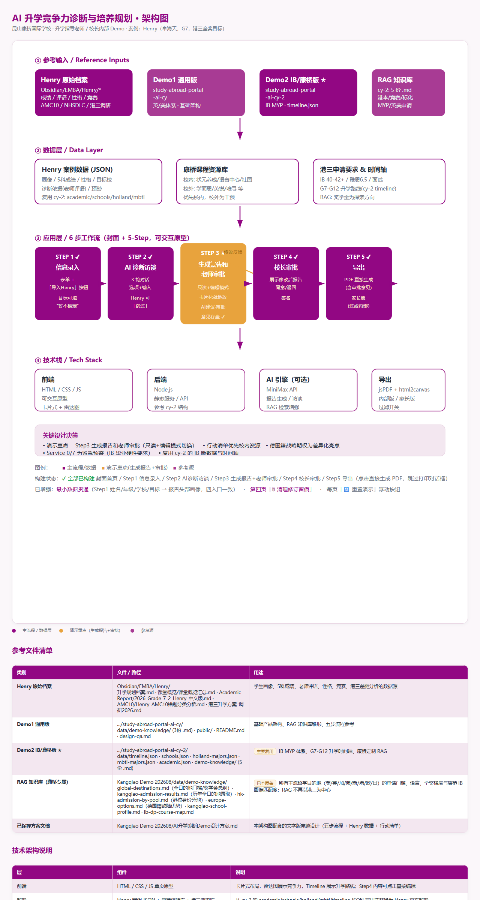

# 康桥 AI 升学竞争力诊断与培养规划 · 可交互 Demo

> 华盛顿大学圣路易斯分校（WashU）EMBA · AI Practicum 项目 × 康桥国际学校 联合 Demo
> 产品概念：**AI Education Navigator** —— 面向国际学校的 AI 升学竞争力诊断与培养规划服务（B2B2C，先进入学校服务升学指导老师，再面向家庭）

---

## 这个 Demo 是什么

一个**可交互网页原型**，演示「AI 升学诊断 + 老师现场批改 + 校长审批 + 导出」的完整闭环。
演示案例主角为康桥 G7 学生 **Henry（牟海天，德国籍）**，目标港三全奖。

> ⚠️ **重要声明（演示前务必讲清）**：本 Demo 的 AI 访谈 / AI 建议弹窗为**预设脚本分支**，**未接入真实大模型（MiniMax）与 RAG 知识库**。它展示的是「产品交互流程与体验」，不是已上线的 AI 服务。

---

## 系统架构



> 矢量源文件：`AI升学诊断Demo_架构图.html`（下载后用浏览器打开可查看/缩放）

---

## 五步流程（封面 + 5 步）

| 步骤 | 页面 | 说明 |
|------|------|------|
| 封面 | `index.html` | 产品名 / 价值主张 / 亮点卡 / 开始演示 |
| Step1 信息录入 | `input.html` | 基本信息、升学目标、MYP 五科成绩、老师评语、活动成绩、特殊资产；支持**导入 Henry 示例**与**上传 PDF/图片识别**（浏览器端 Tesseract.js OCR + PDF.js） |
| Step2 AI 诊断访谈 | `interview.html` | Chatbot 式特殊信息挖掘：按回答动态追问（目标国家 / 国籍→欧盟期权分支 / 课外成就），挖到的资产实时入面板 |
| Step3 生成报告 + 老师审批 | `report.html` | AI 诊断报告初稿；老师可**进入编辑模式**现场改文字/星级、看 AI 建议、留修订留痕、填审批意见并提交 |
| Step4 校长审批 | `principal.html` | 审阅老师改后版本、看修订留痕（可一键清理）、同意 / 退回 + 签名 |
| Step5 导出 | `export.html` | 点击**直接生成 PDF**（jsPDF + html2canvas，跳过打印对话框）：内部版 / 家长版 |

每页右下角有「🔄 重置演示」浮动按钮，一键清空本地数据回到首页。

---

## 本地运行

```bash
cd demo
node server.js          # 零依赖 Node 静态服务，默认端口 8080
# 浏览器打开 http://localhost:8080
```

要求：Node.js 14+。无需 `npm install`（零依赖）。

---

## 在线演示（CloudStudio 公网托管）

无需本地环境，直接浏览器打开即可体验完整五步流程：

🔗 **https://ff3c77577dcd499281e64d696c790e6e.app.workbuddy.link**

> 该链接由 CloudStudio 沙箱静态托管，内容与 `demo/public/` 一致；每页右下角「🔄 重置演示」可清空本地数据。链接长期有效，部署由 WorkBuddy 桌面端「设置 - 数据管理 - 我发布的应用」管理。

---

## 技术栈

- **后端**：Node.js 原生 `http` 模块，零依赖静态文件服务（`demo/server.js`）
- **前端**：原生 HTML / CSS / JS，数据驱动（`window.HENRY` 预置对象）
- **持久化**：浏览器 `localStorage`（录入 / 老师改后报告 / 审批意见 / 访谈结果 / 修订留痕）
- **PDF**：`jsPDF` + `html2canvas`（CDN 懒加载，首次需联网）
- **OCR**：`Tesseract.js`（中+英）+ `PDF.js`（CDN 懒加载，首次需联网下载模型）
- **配色**：康桥紫（`public/css/kangqiao.css`）

---

## 数据贯通现状（诚实标注）

- ✅ **最小贯通已完成**：Step1 录入的「姓名 / 年级 / 学校 / 目标」经 `applyInputOverride()` 接入报告头部画像（只读报告 / 老师编辑卡 / 校长页 / 导出 PDF 四入口一致）；无录入时自动回退 Henry 预设。
- ⏳ **完整贯通待做**：MYP 成绩、诊断结论、行动清单仍用 Henry 预设常量，未在录入/访谈变化时动态生成。

---

## 目录结构

```
Kangqiao Demo 202608/
├── demo/                      # 可运行 Demo（零依赖 Node 静态站）
│   ├── server.js              # 本地静态服务
│   └── public/
│       ├── index.html         # 封面 / 首页
│       ├── input.html         # Step1 信息录入
│       ├── interview.html     # Step2 AI 访谈
│       ├── report.html        # Step3 生成报告 + 老师审批
│       ├── principal.html     # Step4 校长审批
│       ├── export.html        # Step5 导出 PDF
│       ├── css/               # kangqiao.css / teacher.css
│       └── js/                # henry-data.js / report3.js / teacher.js（interview.html 为内联脚本）
├── AI升学诊断Demo设计方案.md    # 完整文字方案
├── AI升学诊断Demo_架构图.html   # 架构图（SVG 源文件）
├── architecture.png             # 架构图（GitHub README 预览用）
├── 0.1 Requirements/         # 需求来源材料
├── 0.2 Inputs/               # 输入材料（D1–D5 报告、竞品、财务模型等）
├── 00 Idea/                  # 立项素材（团队 deck、提案书等）
└── data/                     # 爬取的康桥升学数据等
```

---

## 待完善 / Roadmap

- 接入真实大模型（MiniMax）+ RAG 检索增强，替换预设脚本访谈
- 完整数据贯通（任意录入动态生成报告）
- 服务端渲染导出可选中文字的矢量 PDF（替代当前图片版）
- 多学生档案管理（当前为单案例演示）

---

## 声明

本仓库为 EMBA 课程 Demo 演示用途，数据为脱敏预设案例，不构成任何升学承诺或建议。
